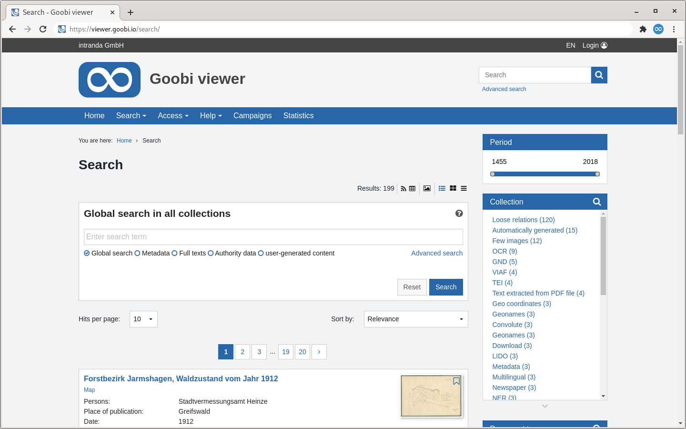

# 1.17 Search

The search in the Goobi viewer allows a combined search both in the metadata and in the full texts. Depending on the selection, a search can also be restricted to the metadata or the full texts of the digital collections. Links of search terms, a search with right or left truncation or a phrase search are also possible.



Depending on the precision of the search query and the number of indexed records, a very large number of search hits may result. These are displayed spread over several pages. A drop-down menu is available to the user, where he can select the number of search hits displayed per page. This list can be configured as follows:



```markup
<search>
    <hitsPerPage>
        <value default="true">10</value>
        <value>25</value>
        <value>50</value>
        <value>100</value>
    </hitsPerPage>
    <fulltextFragmentLength>120</fulltextFragmentLength>
</search>
```



The element `fulltextFragmentLength` defines the approximate length of the full text sections for the search hit display. The default value is 200. 

The following configuration block is available to define the search ranges of the simple search:



```markup
<search>
    <filters>
        <filter>filter_ALL</filter>
        <filter>filter_DEFAULT</filter>
        <filter>filter_FULLTEXT</filter>
        <!-- <filter>filter_NORMDATATERMS</filter> -->
        <!-- <filter>filter_UGCTERMS</filter> -->
    </filters>
</search>
```



Each filter entry creates a new radio button below the simple search.

