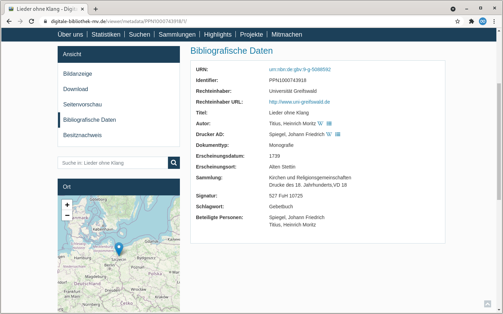
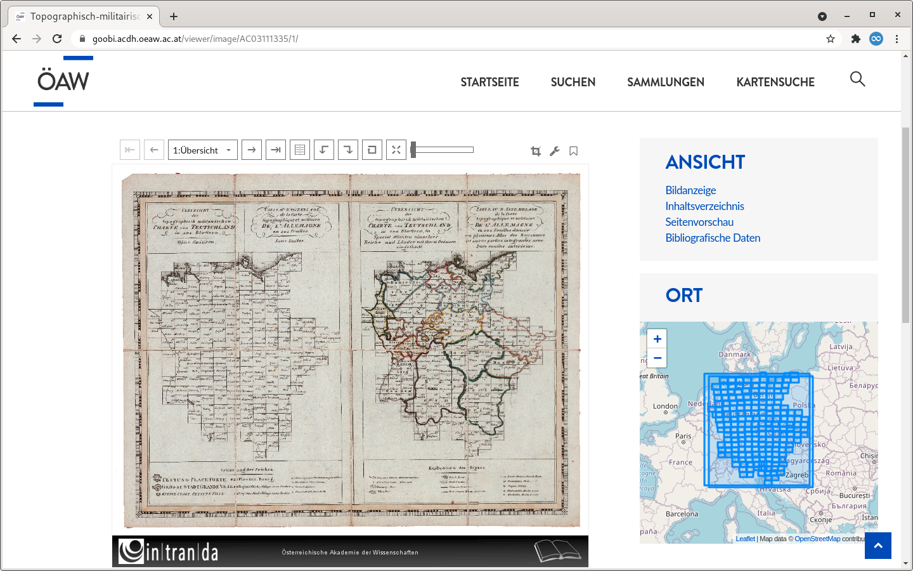

# 1.6 Maps

## General 

The Goobi viewer supports the display of coordinates on a map. There are different possibilities for the acquisition, the indexing and the display. These are listed on this page.

## Acquisition and indexing 

### GND 

The simplest option is when, for example, a publication location is linked to a GND record immediately upon import from the catalog and this record contains coordinates. 

#### Goobi workflow



```markup
<!-- Definition -->
<MetadataType normdata="true">
    <Name>PlaceOfPublication</Name>
    <language name="de">Erscheinungsort</language>
    <language name="en">place of publication</language>
</MetadataType>

<!-- ... -->

<!-- MODS Export -->
<Metadata>
    <InternalName>PlaceOfPublication</InternalName>
    <WriteXPath>./mods:mods/mods:originInfo[1]/#mods:place/mods:placeTerm[@type='text']</WriteXPath>
</Metadata>

```



#### Goobi viewer Indexer 



```markup
<MD_PLACEPUBLISH>
    <list>
        <item>
            <xpath>mets:xmlData/mods:mods/mods:originInfo[not(mods:edition[text() = '[Electronic ed.]'])]/mods:place/mods:placeTerm[@type="text"]</xpath>
            <getchilds>all</getchilds>
            <addToDefault>true</addToDefault>
            <groupEntity type="LOCATION" addCoordsToDocstruct="true">
                <field name="MD_VALUE">text()</field>>
                <field name="NORM_URI">@valueURI</field>
            </groupEntity>
        </item>
    </list>
</MD_PLACEPUBLISH>
```



#### Example

In an exported METS/MODS file, the markup of a publication location could look like this and the display in the Goobi viewer could then look like the following screenshot:

```markup
<mods:originInfo>
    <mods:place>
        <mods:placeTerm authority="gnd" authorityURI="http://d-nb.info/gnd/" type="text" valueURI="http://d-nb.info/gnd/4057392-8">Alten Stettin</mods:placeTerm>
    </mods:place>
</mods:originInfo>
```



### GeoNames

Metadata can also be linked to the GeoNames authority database as shown in the following configuration.

#### Goobi workflow



```markup
<!-- Definition -->
<MetadataType normdata="true">
    <Name>SubjectGeographic</Name>
    <language name="de">Geographisches Schlagwort</language>
    <language name="en">GeographicPerson</language>
</MetadataType>

<!-- ... -->

<!-- MODS Export -->
<Metadata>
    <InternalName>SubjectGeographic</InternalName>
    <WriteXPath>./mods:mods/mods:subject/#mods:geographic[@type="text"]</WriteXPath>
</Metadata>
```



#### Goobi viewer Indexer



```markup
<MD_SUBJECTGEOGRAPHIC>
    <list>
        <item>
            <xpath>mets:xmlData/mods:mods/mods:subject/mods:geographic</xpath>
            <getchilds>all</getchilds>
            <addToDefault>true</addToDefault>
            <groupEntity type="OTHER" addCoordsToDocstruct="true">
                <field name="MD_VALUE">text()</field>
                <field name="MD_DISPLAYFORM">text()</field>
                <field name="NORM_URI_VIAF">@valueURI</field>
            </groupEntity>
        </item>
    </list>
</MD_SUBJECTGEOGRAPHIC>
```



#### Beispiel

In an exported METS/MODS file, the labeling of the geographic keyword could look like this and the display in the Goobi viewer could then look like the following screenshot:

```markup
<mods:geographic type="text" valueURI="http://www.geonames.org/2766155">Schärding</mods:geographic>
```


### Latitude and longitude 

#### Recorded separately 

If coordinates are available as latitude and longitude, they can be recorded separately.

**Goobi** **workflow**



```markup
<!-- Definition -->
<MetadataType>
    <Name>locationNameDE</Name>
    <language name="de">Name DE</language>
    <language name="en">locationNameDE</language>
</MetadataType>
<MetadataType>
    <Name>locationLatitude</Name>
    <language name="de">Latitude</language>
    <language name="en">locationLatitude</language>
</MetadataType>
<MetadataType>
    <Name>locationLongitude</Name>
    <language name="de">Longitude</language>
    <language name="en">locationLongitude</language>
</MetadataType>

<Group>
    <Name>LocationGroup</Name>
    <language name="de">Ort</language>
    <language name="en">Location</language>
    <metadata>locationNameDE</metadata>
    <metadata>locationLatitude</metadata>
    <metadata>locationLongitude</metadata>
</Group>
        
<!-- ... -->

<!-- MODS Export -->
<Group>
    <InternalName>LocationGroup</InternalName>
    <WriteXPath>./mods:mods/mods:extension/#intranda:location</WriteXPath>
    <Metadata>
        <InternalName>locationNameDE</InternalName>
        <WriteXPath>./intranda:name[@language='ger']</WriteXPath>
    </Metadata>
    <Metadata>
        <InternalName>locationLatitude</InternalName>
        <WriteXPath>./intranda:latitude</WriteXPath>
    </Metadata>
    <Metadata>
        <InternalName>locationLongitude</InternalName>
        <WriteXPath>./intranda:longitude</WriteXPath>
    </Metadata>
</Group>
```



**Goobi viewer Indexer**

```markup
<MD_COORDINATES>
    <list>
        <item>
            <xpath>mets:xmlData/mods:mods/mods:extension/intranda:location</xpath>
            <addToDefault>true</addToDefault>
            <onefield>false</onefield>
            <geoJSONSource separator=" / " addSearchField="true">mods:coordinates/point</geoJSONSource>
            <groupEntity type="LOCATION">
                <field name="MD_VALUE">concat(intranda:longitude/text(), " / ", intranda:latitude/text())</field>
            </groupEntity>
        </item>
    </list>
</MD_COORDINATES>
```

**Example**

Latitude and longitude information are not provided in MODS, so they are exported to a separate namespace. The display is then done as point coordinates as already shown above in screenshots

```markup
<mods:extension>
    <intranda:location>
        <intranda:name language="ger">Schönwalde</intranda:name>
        <intranda:latitude>53.586123100000002</intranda:latitude>
        <intranda:longitude>15.733848099999999</intranda:longitude>
    </intranda:location>
</mods:extension>
```

#### Recorded together

Latitude and longitude can also be acquired together.

**Goobi workflow**



```markup
<!-- Definition -->
<MetadataType>
    <Name>Coordinates</Name>
    <language name="de">Koordinaten (Lat+Lon)</language>
    <language name="en">Coordinates (Lat+Lon)</language>
</MetadataType>

<!-- ... -->

<!-- MODS Export -->
<Metadata>
    <InternalName>Coordinates</InternalName>
    <WriteXPath>./mods:mods/mods:extension/intranda:cartographics/#intranda:coordinates</WriteXPath>
</Metadata>
```



**Goobi viewer Indexer**

For jointly captured metadata, the values are split at a configured separator during indexing.



```markup
<MD_COORDINATES>
    <list>
        <item>
            <xpath>mets:xmlData/mods:mods/mods:extension/intranda:location/intranda:coordinates</xpath>
            <addToDefault>true</addToDefault>
            <onefield>false</onefield>
            <geoJSONSource separator=" / " addSearchField="true">intranda:coordinates/point</geoJSONSource>
        </item>
    </list>
</MD_COORDINATES>
```



**Example**

The display then takes place as point coordinates as already shown above in screenshots.

```markup
<mods:cartographics>
    <mods:coordinates>54.04592419999999 / 13.247582599999987</mods:coordinates>
</mods:cartographics>
```

### Bounding Box

Maps can be captured and displayed not only as points, but also as bounding boxes. The coordinates can be determined very easily with a bounding box tool from Klokantech:



Below the map there is a copy and paste field for the MARC field 034. The content of the individual subfields is explained using the following example:

```markup
# example field content for 034
$$dE0081339$$eE0083333$$fN0533708$$gN0532442

# Subfeldzuordnung
$d - westernmost longitude: E0081339
$e - easternmost longitude: E0083333
$f - northernmost latitude: N0533708
$g - southernmost latitude: N0532442
```

#### Goobi workflow



```markup
<!-- Definition -->
<MetadataType>
    <Name>CoordinatesWesternmostLongitude</Name>
    <language name="de">Koordinaten: westlichster Längengrad</language>
    <language name="en">Coordinates: westernmost longitude</language>
</MetadataType>
<MetadataType>
    <Name>CoordinatesEasternmostLongitude</Name>
    <language name="de">Koordinaten: östlichster Längengrad</language>
    <language name="en">Coordinates: easternmost longitude</language>
</MetadataType>
<MetadataType>
    <Name>CoordinatesNorthernmostLatitude</Name>
    <language name="de">Koordinaten: nördlichster Breitengrad</language>
    <language name="en">Coordinates: northernmost latitude</language>
</MetadataType>
<MetadataType>
    <Name>CoordinatesSouthernmostLatitude</Name>
    <language name="de">Koordinaten: südlichster Breitengrad</language>
    <language name="en">Coordinates: southernmost latitude</language>
</MetadataType>

<!-- ... -->

<!-- MODS Export -->
<Metadata>
    <InternalName>CoordinatesWesternmostLongitude</InternalName>
    <WriteXPath>./mods:mods/mods:subject/mods:cartographics/#mods:coordinates[@type='western']</WriteXPath>
</Metadata>
<Metadata>
    <InternalName>CoordinatesEasternmostLongitude</InternalName>
    <WriteXPath>./mods:mods/mods:subject/mods:cartographics/#mods:coordinates[@type='eastern']</WriteXPath>
</Metadata>
<Metadata>
    <InternalName>CoordinatesNorthernmostLatitude</InternalName>
    <WriteXPath>./mods:mods/mods:subject/mods:cartographics/#mods:coordinates[@type='northern']</WriteXPath>
</Metadata>
<Metadata>
    <InternalName>CoordinatesSouthernmostLatitude</InternalName>
    <WriteXPath>./mods:mods/mods:subject/mods:cartographics/#mods:coordinates[@type='southern']</WriteXPath>
</Metadata>
```



#### Goobi viewer Indexer



```markup
<MD_GPS_POLYGON>
    <list>
        <item>
            <xpath>concat(mets:xmlData/mods:mods/mods:subject/mods:cartographics/mods:coordinates[@type="western"], ' ', mets:xmlData/mods:mods/mods:subject/mods:cartographics/mods:coordinates[@type="eastern"], ' ', mets:xmlData/mods:mods/mods:subject/mods:cartographics/mods:coordinates[@type="northern"], ' ', mets:xmlData/mods:mods/mods:subject/mods:cartographics/mods:coordinates[@type="southern"])</xpath>
            <addToDefault>false</addToDefault>
            <addUntokenizedVersion>false</addUntokenizedVersion>
            <onefield separator="#SPACE#">true</onefield>
            <geoJSONSource addSearchField="true">sexagesimal:polygon</geoJSONSource>
        </item>
    </list>
</MD_GPS_POLYGON>
```



#### Example

The point coordinates are marked individually and are aggregated to a rectangle during indexing. The screenshot below shows an atlas where the individual maps of the structural elements have also been georeferenced.

```markup
<mods:cartographics>
    <mods:coordinates type="western">E0081339</mods:coordinates>
    <mods:coordinates type="eastern">E0083333</mods:coordinates>
    <mods:coordinates type="northern">N0533708</mods:coordinates>
    <mods:coordinates type="southern">N0532442</mods:coordinates>
</mods:cartographics>
```



## Search via URL 

Since version 4.6 the Goobi viewer supports the search for coordinates. GML points and polygons \(as in DenkXweb\) as well as mods:coordinates can be indexed as geoJSON and displayed on maps. Furthermore, faceting queries for searches for points, points in polygons, polygon intersections can be passed directly in the URL. For this the coordinates are indexed as WKT.   
To allow faceting to be as versatile as possible, the entire WKT query must be formulated in the client \(i.e., in JavaScript, for example\). Examples are: 

* Search for point: `https://viewer.example.org/search/-/-/1/-/WKT_COORDS:"Intersects(POINT(9.86929194928373 51.8163517626803)) distErrPct=0"/`
* Contained in the polygon \(for example, points\):  `https://viewer.example.org/search/-/-/1/-/WKT_COORDS:"IsWithin(POLYGON((0 0, 0 90, 90 90, 90 0, 0 0))) distErrPct=0"/`
* Partially contained in polygon \(for example, other polygon\):  `https://viewer.example.org/search/-/-/1/-/WKT_COORDS:"Intersects(POLYGON((0 0, 0 90, 90 90, 90 0, 0 0))) distErrPct=0"/`
* Not included in the polygon: `https://viewer.example.org/search/-/-/1/-/WKT_COORDS:"IsDisjointTo(POLYGON((0 0, 0 -90, -90 -90, -90 0, 0 0))) distErrPct=0"/`

More information about indexing can be found in chapter 2.5 of the Goobi viewer indexer configuration.

## Configuration 

In order to display indexed geocoordinates on a map, a corresponding Solr query must be formulated. This can be for example all plants with indexed geo-coordinates: 

```markup
+BOOL_WKT_COORDS:true
```

Alternatively, all records that have geo-coordinates in a specific field and belong to a collection:

```markup
+MD_COORDINATES:* +DC:archives*
```

It is important that the fields in which the coordinates have been indexed are made known to the Goobi viewer. For this, the field must be defined in the following list within `config_viewer.xml`:



```markup
<maps>
    <coordinateFields>
        <field>MD_GEOJSON_POINT</field>
        <field>NORM_COORDS_GEOJSON</field>
    </coordinateFields>
</maps>
```



