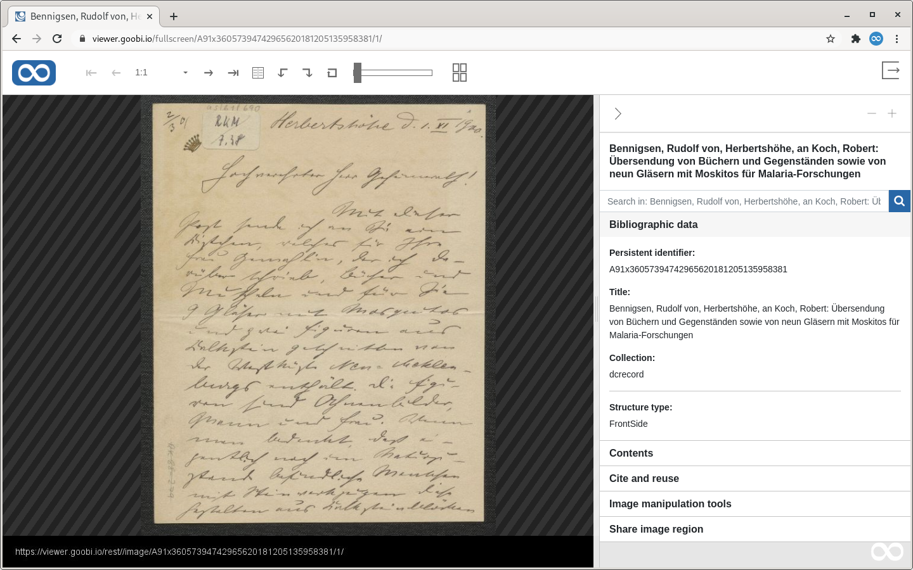
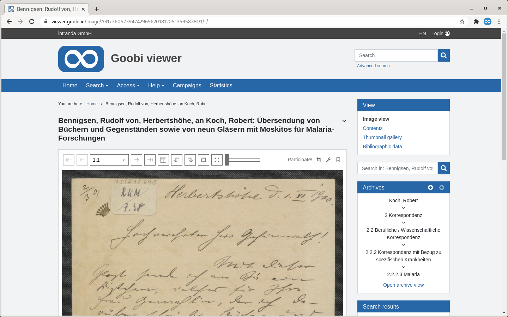

# 3. Glossary

## A

### Adminbackend

The admin backend describes an interface through which parts of the content and functionality of the Goobi viewer can be controlled web-based. The interface is only available to user accounts with administrator rights or user accounts with extended rights, for example for campaigns or the CMS. 

See also chapter 2 and subpages in the user interface section.

### Archive view

The archive view describes a view specially designed for displaying archive holdings.

## C

### Campaigns

The campaigns describe a functionality of the Goobi viewer with which crowdsourcing can be realised. Image areas can be annotated, georeferenced or metadata can be added. The campaigns are fully IIIF compliant and are managed via the admin backend.

See also chapter 2.3 in the user interface section.

In contrast to the crowdsourcing module, the campaigns are open source.

### Collections

Collections and sub-collections refer to the functionality of combining several works into collections. The term "digital collection" and "sub-collections" are used here as synonyms.

### Content area

Designation for the part of the layout in which content such as images, full texts, search results or CMS content is displayed. See also Chapter 1 in the Interface section.

### Crowdsourcing Module

With the crowdsourcing module, full-text coordinates can be created and edited. The designation is in distinction to the campaigns. The module is subject to a fee.

## D

### digital collections

See collections.

## F

### Footer

Designation for the area at the very end of a page. In the footer, for example, opening hours, contact details, links to the imprint or data protection can be indicated. See also Chapter 1 in the Interface section.

### Fullscreen View

The fullscreen view displays all information on a work centrally. It can be opened via the corresponding icon above the image or directly via the URL.

## H

### Header

Designation for the area at the very top of a web page. The header can contain, for example, a logo, a title and the main menu.

See also chapter 1 in the user interface section.

## P

### Paginator

A paginator offers the possibility to scroll between different pages. This can be, for example, several pages of search results, but also between the individual images within a work.

## R

### Record view

The term Work View or Work Display refers to the display of a data set in the Corporate Design. As a rule, this means the image display. However, the term also includes the table of contents, the page preview or the bibliographic data. The term is used in distinction to the terms full screen view and archive view.

## S

### Sidebar

The sidebar is the part of the layout that is displayed to the left or right of the content area. Depending on the page displayed, the sidebar contains various widgets, for example, in the search the options for faceting or in the work view the options for navigating in the work, a table of contents or metadata. See also Chapter 1 in the Interface section.

## W

### Widget

A widget is an element in the sidebar. Depending on the page displayed and the functionality activated, the Goobi viewer offers various options here. For example, in the screenshot above for the record view, the widgets "View", "Search in record", "Archive" and "Search hits" can be seen.

